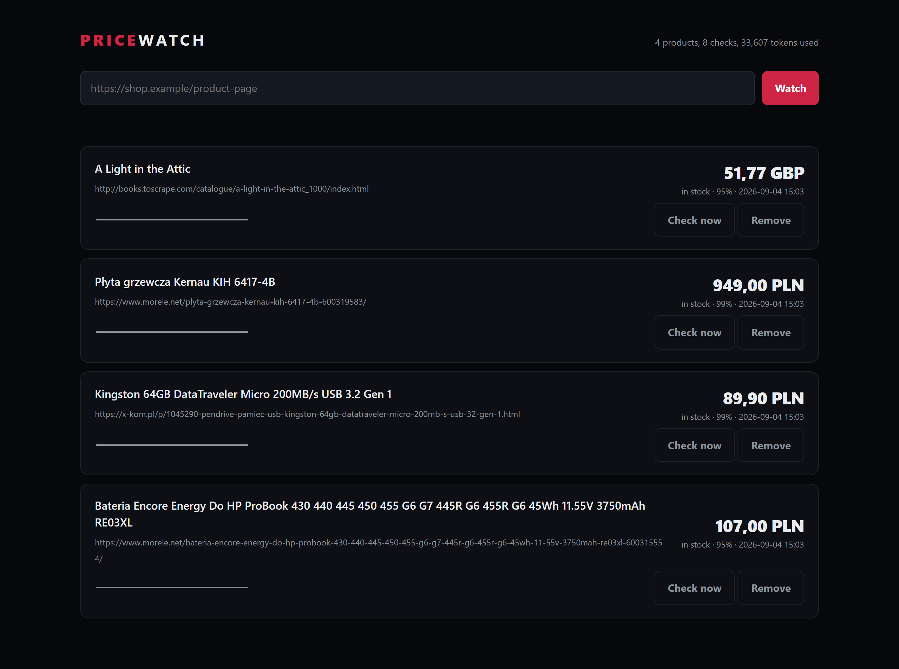
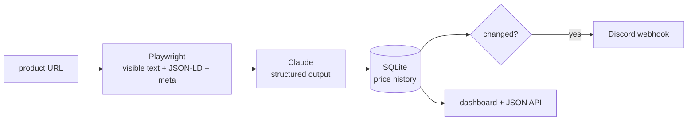

# pricewatch-agent

Point it at any product page. A real browser loads the page, Claude reads the price and stock status out of the visible text, SQLite keeps the history, Discord gets a message when something changes.

No parser per shop. The same prompt handled a demo bookshop, morele.net and x-kom.pl on the first try, and the model is asked to quote the line it took the price from, so every reading can be checked.



## Why a language model for this

Classic scrapers break every time a shop changes its HTML, and every shop needs its own selectors. Here the page is reduced to what a human sees (visible text, title, JSON-LD and meta tags), and the model returns a small JSON object with a schema enforced by the API:

```json
{ "name": "Kingston 64GB DataTraveler Micro 200MB/s USB 3.2 Gen 1", "price": 89.9, "currency": "PLN", "in_stock": true, "confidence": 0.99, "evidence": "Cena: 89,90 zł" }
```

One check costs a few thousand input tokens. With Haiku 4.5 that is well under one cent per product.

## How it works



1. `src/fetch.ts` opens the page in headless Chromium, blocks images, media and fonts, and returns `innerText`, the title, JSON-LD blocks and meta tags. CSS is kept on purpose: without it hidden modals and old prices would leak into the text.
2. `src/text.ts` builds the model input: URL, title, product hints from JSON-LD and meta, every line that looks like a price, then the page text clipped to 12k characters. The price lines go in first, so the price survives the clipping.
3. `src/extract.ts` calls the Messages API with `output_config.format` built from a zod schema, temperature 0. The API guarantees the shape, zod and `normalize()` guard the values.
4. `src/watch.ts` stores a snapshot, compares it with the previous one and sends a Discord embed on a price or stock change. A check that could not read the price does not raise an alert, it is a reading error, not a price change.
5. `src/server.ts` serves a one-file dashboard and a JSON API.

## Quick start

```bash
git clone https://github.com/Brancuuuu/pricewatch-agent.git
cd pricewatch-agent
npm install
npx playwright install chromium
cp .env.example .env        # put your ANTHROPIC_API_KEY in .env
```

```bash
npm run pricewatch -- add "https://www.morele.net/plyta-grzewcza-kernau-kih-6417-4b-600319583/"
# #2 added: https://www.morele.net/plyta-grzewcza-kernau-kih-6417-4b-600319583/
# #2  |  Płyta grzewcza Kernau KIH 6417-4B  |  949,00 PLN  |  in stock  |  conf 99%  |  4640+55 tok

npm run pricewatch -- list          # last known price of every product
npm run pricewatch -- check         # fetch all pages now
npm run pricewatch -- check 2 --json
npm run watch                       # check every WATCH_INTERVAL_MINUTES
npm run serve                       # dashboard at http://localhost:8790
```

Set `DISCORD_WEBHOOK_URL` in `.env` to get alerts. Everything else has defaults, see `.env.example`.

### Docker

```bash
docker compose up -d
```

Two containers share `./data`: `dashboard` on port 8790 and `watcher` running the loop. The image is the official Playwright image, so Chromium is already there.

### JSON API

| Method | Path | What it does |
|---|---|---|
| GET | `/api/products` | all products with their last snapshot and token totals |
| POST | `/api/products` | `{ "url": "..." }` adds a product |
| GET | `/api/products/:id` | product with full history |
| POST | `/api/products/:id/check` | fetch and extract now |
| DELETE | `/api/products/:id` | stop watching |

## Evals

Prompts change, models change, and "it worked on the page I tried" is not a test. `evals/cases` holds captured pages with the expected values checked by hand against the shop. The runner feeds the captures to the extractor without touching the network and reports accuracy:

```
PASS  books-toscrape   expected 51.77 GBP  got 51.77 GBP  stock true / true  1507 tok  1560 ms
PASS  morele-battery   expected 107 PLN    got 107 PLN    stock true / true  5103 tok  1979 ms
PASS  morele-hob       expected 949 PLN    got 949 PLN    stock true / true  4690 tok  2960 ms
PASS  xkom-pendrive    expected 89.9 PLN   got 89.9 PLN   stock true / true  5513 tok  1841 ms

claude-haiku-4-5-20251001: 4/4 passed (100%)
```

```bash
npm run evals                                   # default model from .env
npm run evals -- claude-sonnet-4-5              # compare another model
npm run evals:capture -- <url> <case-name>      # add a case, then fill in "expected"
```

Unit tests (`npm test`) cover the text pipeline, the store and the change detection. They need no API key and run in CI.

## Limits and etiquette

- Check `robots.txt` and the terms of the shop you watch. The watcher makes one request per product per interval and identifies itself in the User-Agent.
- Some shops block headless browsers. x-kom worked, others may not, and a proxy is out of scope here.
- A page with several offers (bundles, variants) can confuse the model. The stored `confidence` and `evidence` show what it based the price on.
- The model never sees images, so a price rendered as an image is invisible to it.

## Roadmap

- Email and Slack channels next to Discord
- Cookie banner dismissal for shops that hide the price behind consent
- Price history chart per product
- Per-product thresholds, alert only below a target price

## Po polsku

Monitor cen, który nie potrzebuje parsera pod każdy sklep. Playwright otwiera stronę produktu, Claude wyciąga z widocznego tekstu cenę, walutę i dostępność jako JSON o wymuszonym schemacie, SQLite trzyma historię, a przy zmianie ceny leci powiadomienie na Discorda. Do tego dashboard, API, Docker i zestaw evals, który mierzy trafność po każdej zmianie promptu albo modelu. Uruchomienie: `npm install`, `npx playwright install chromium`, klucz API w `.env`, `npm run pricewatch -- add <adres>`.

## License

MIT, Rafał Branc ([ravdev.pl](https://ravdev.pl)).
